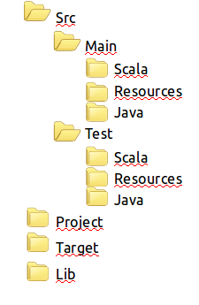
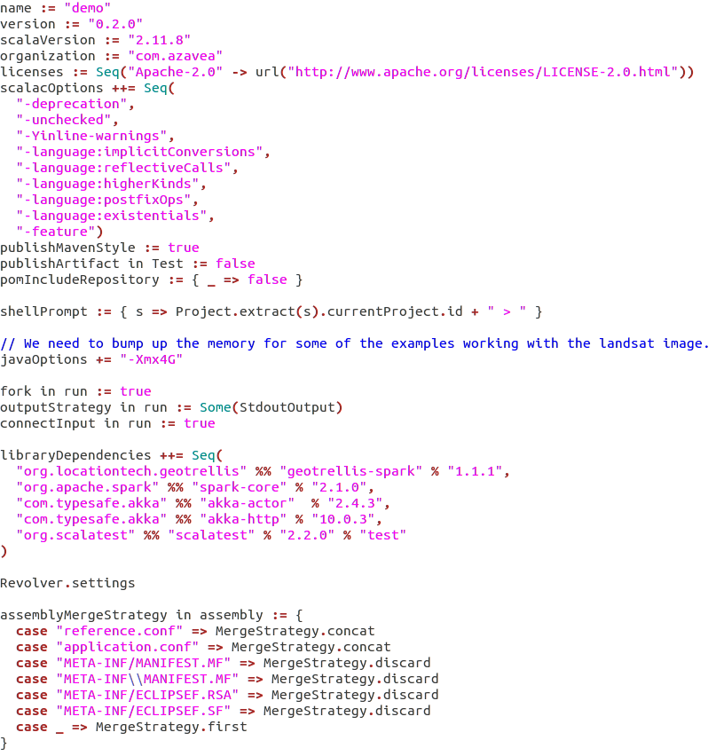

> **Project status:** not completed :warning: </br>
> **Author:** Juliana Marino Balera :busts_in_silhouette:

# Álgebra de mapas com o framework GeoTrellis :earth_americas:

O presente repositório é fruto de um experimento que foi desenvolvido durante a Disciplina CAP349-3-Banco de Dados Geográficos no curso de Pós-Graduação em Computação Aplicada do INPE. A metodologia e a implementação oficiais podem ser encontradas no portal de queimadas do DGI/INPE (http://queimadas.dgi.inpe.br/queimadas/portal). O experimento é focado no uso da biblioteca GeoTrellis para realizar cálculos de Álgebra de Mapas para obter o risco de queimadas em determinadas regiões do Brasil.   

# Como usar esse projeto :interrobang:

GeoTrellis é uma biblioteca de código aberto escrita na linguagem de programação Scala cujo objetivo é o suporte a manipulação de dados espaciais (Conheça mais sobre a biblioteca no site https://docs.geotrellis.io/en/latest/CHANGELOG.html#). A sua instalação, no Ubuntu, se da de acordo com os passos listados a seguir:

Atualize a versão do java que você tem em seu computador, através dos comandos:

```
sudo add-apt-repository ppa:webupd8team/java 
sudo apt-get update 
sudo apt-get install oracle-java8-installer
```
Obtenha a versão atual da bilioteca GeoTrellis através do comando:
```
git clone https://github.com/geotrellis/geotrellis-sbt-template.git 
```


Pronto! É obtido um projeto Scala em branco com todas as configurações prontas para se utilizar a biblioteca GeoTrellis. O projeto obtido tem a seguinte estruturação de diretórios:

<p align="center"></p>

Os arquivos de código scala que você vai escrever devem ser colocados no diretório src/main/scala. Por default, o projeto já vem com um projeto do tipo “hello, world”.

Para executar os arquivos scala utilizando a biblioteca GeoTrellis, basta você entrar na pasta do projeto baixado no item B e digitar o comando:

```			
./sbt 
```

Talvez, o comando acima não funcione, uma vez que o Ubuntu pode não reconhecer oo arquivo sbt como um executável, para solucionar isso, digite:
	
```
chmod u+x sbt
```

e depois execute novamente o comando ./sbt. 

Nesse ponto, devemos nos preocupar com dois arquivos em especial: sbt e build.sbt. O arquivo sbt na verdade é um script de configuração/auxílio a compilação tipicamente usado em projetos scala. Nesse arquivo, você pode definir a quantidade de memória disponível para a sua aplicação. Esse arquivo, chama um arquivo de configuração, que está no mesmo diretório, chamado build.sbt:


<p align="center"></p>


Para abrir um terminal, digite:

```
./sbt 
console 
```

Abrirá então um terminal scala e pronto, é só usar.

# QuickStart :arrow_forward:

Quando estiver no terminal scala de acordo com os passos anteriores...
```
scala> import geotrellis.raster._
scala> import geotrellis.raster.mapalgebra.focal._
```

Para executar um script na pasta do projeto geotrellis basta digitar:
```
> ./sbt
> run nome_do_script
```

